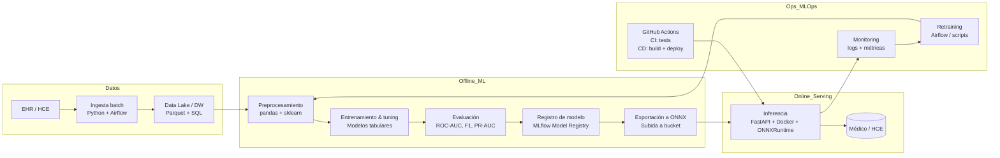

# Rare Disease Triage – Pipeline MLOps (Reestructuración Semanas 5–6)

- **Autor:** D W
- **Curso:** MLOps – Semanas 5–6: Pipeline de MLOps (Reestructuración)
- **Repositorio:** https://github.com/Danielgm93/mlops-rare-disease

Este repositorio describe un **pipeline MLOps end-to-end** para un sistema de **triage de enfermedades** (comunes y huérfanas) a partir de síntomas y datos clínicos de pacientes.

La reestructuración de Semanas 5–6 tiene como propósito:

- Retomar la propuesta inicial de las Semanas 1–2.
- Incorporar los conceptos de MLOps vistos durante el curso.
- Definir un proceso **end-to-end** suficientemente detallado para que un equipo de ML pueda implementarlo.
- Alinear el diseño con:
  - El código actual del repositorio (FastAPI + Docker + CI/CD).
  - Los requisitos del **proyecto final** (modelos ONNX, descarga desde bucket, despliegue automático en dev/prod).

---

## 1. Problema y alcance

### 1.1 Descripción del problema

En el contexto médico:

- Para **enfermedades comunes**, suelen existir grandes volúmenes de datos históricos (registros EHR/HCE).
- Para **enfermedades huérfanas** o de baja prevalencia, los datos son escasos y desbalanceados.

Se requiere un sistema que, dado un vector de síntomas y variables clínicas básicas de un paciente, estime si:

- No presenta indicios relevantes de enfermedad.
- Puede estar cursando una enfermedad de tipo **leve/aguda/crónica**.
- Puede estar ante un cuadro compatible con una **enfermedad huérfana**, donde la prioridad es no dejar pasar casos de riesgo (alta sensibilidad).

El sistema se concibe como **herramienta de triage y priorización**, no como sustituto del diagnóstico médico.

### 1.2 Objetivo del pipeline MLOps

El pipeline MLOps propuesto debe permitir:

1. Ir desde **datos clínicos crudos** hasta modelos entrenados, versionados, auditables y exportados a **ONNX**.
2. Desplegar estos modelos como **servicios web** accesibles para los médicos:
   - En un **computador local** (contenedor ligero, sin dependencia de la nube si los recursos lo permiten).
   - En un **servidor o servicio en la nube**, accesible vía HTTP/HTTPS.
3. Incorporar prácticas MLOps para:
   - Versionado de **datos**, **modelos** y **código**.
   - Integración y despliegue continuo (**CI/CD** con GitHub Actions).
   - Monitoreo del servicio y del modelo, y ciclo de **reentrenamiento**.
   - 
4. CI/CD y GitHub Actions

El pipeline de integración y despliegue continuo (CI/CD) está implementado usando **GitHub Actions** para garantizar que el código se pruebe automáticamente y se despliegue sin errores.

Flujo de trabajo con GitHub Actions, el cual se ha configurado para automatizar las pruebas y el despliegue del proyecto:

- Evento PR (Pull Request)**:
   - Cuando se crea un pull request hacia la rama `main`, GitHub Actions ejecuta automáticamente pruebas unitarias para verificar que el código no rompa funcionalidades existentes. Este proceso está definido en el archivo de flujo de trabajo **`pr-ci.yml`** dentro de la carpeta **`.github/workflows/`**.
   - Un mensaje automático como **"CI/CD en acción. Ejecutando tareas..."** se publica en el PR, lo que indica que el pipeline ha comenzado.

- Evento Commit (Push)**:
   - Cuando se hace un **commit** directamente a la rama `main`, se ejecutan las pruebas unitarias nuevamente para asegurarse de que el código sigue funcionando correctamente. Además, se construye una imagen Docker con la versión más reciente del modelo y se sube al **GitHub Container Registry (GHCR)**.
   - Al final de este proceso, se publica el mensaje **"CI/CD terminado con éxito."** en el PR para indicar que el proceso ha terminado sin errores.

- Archivos clave de GitHub Actions:

- **pr-ci.yml**: Ejecuta las pruebas unitarias en cada PR.
- **develop-cicd.yml**: Ejecuta las pruebas y despliega la imagen Docker a **GHCR**.

Con esta integración, se asegura que cualquier cambio realizado en el código pase por un proceso de validación automático antes de ser fusionado en la rama principal.

#### 1.4 Monitoreo y Reentrenamiento

El monitoreo continuo es esencial para asegurar que el modelo de predicción siga siendo relevante con el tiempo. 

1. **Monitoreo de Drift**:  
   El modelo se monitorea para detectar **drift de datos**, lo que indica que la distribución de las predicciones ha cambiado debido a nuevos patrones en los datos.

2. **Logging de Predicciones**:  
   Todas las predicciones realizadas por el modelo se registran en archivos de texto (**`predicciones_dev.txt`**, **`predicciones_prod.txt`**), que se almacenan en un bucket externo. Estos logs ayudan a monitorear el desempeño del modelo a lo largo del tiempo y detectar cualquier irregularidad.

3. **Ciclo de Reentrenamiento**:  
   Si se detecta drift en el modelo o si los datos se actualizan significativamente, el modelo pasa por un proceso de **reentrenamiento**. Esto incluye:
   - Recolectar los nuevos datos etiquetados.
   - Reentrenar el modelo con estos datos.
   - Validar que las métricas del modelo estén por encima de los umbrales definidos (por ejemplo, ROC-AUC > 0.85).
   - Subir la nueva versión del modelo al bucket externo.

 ##### 1.5 Tecnologías Usadas

Este proyecto utiliza diversas tecnologías para cada etapa del pipeline, lo que permite construir un sistema robusto y escalable:

- **FastAPI**: Para implementar la API de inferencia. Es rápido y eficiente para construir servicios web ligeros que se pueden ejecutar localmente o en la nube.
- **Docker**: Se utiliza para contenerizar la API y permitir su ejecución en cualquier entorno, ya sea local o en un servidor/nube. Docker facilita el despliegue y la portabilidad del sistema.
- **ONNX**: El modelo de predicción es exportado en formato **ONNX** para asegurar la compatibilidad con diferentes runtimes de inferencia.
- **GitHub Actions**: Para la integración continua (CI) y el despliegue continuo (CD). Estas acciones automatizan las pruebas, construcción de Docker y despliegue de imágenes.
- **Airflow**: Se usa para orquestar la ingesta de datos desde las Historias Clínicas Electrónicas (HCE/EHR) hacia el sistema, gestionando flujos batch de datos.

Cada una de estas tecnologías ha sido elegida por su eficiencia, escalabilidad y capacidad de integración en un pipeline MLOps robusto.

---

## 2. Suposiciones y restricciones

### 2.1 Suposiciones

- Existe una **Historia Clínica Electrónica (HCE/EHR)** con acceso controlado a datos clínicos anonimizados.
- El entrenamiento del modelo se realiza en un entorno **offline**.
- El modelo se ejecuta como servicio dentro de un **contenedor Docker**.
- Los modelos entrenados se almacenan en un **bucket externo**, no dentro del repositorio.
- FastAPI es la tecnología de inferencia.

### 2.2 Restricciones

- Requisitos de **privacidad y ética médica**.
- Manejo de **desbalance extremo** por enfermedades huérfanas.
- Soporte para ejecución **local o en la nube**.

### 2.3 Implicaciones

- Separación clara entre pipeline offline (entrenamiento) y online (serving).
- Uso obligatorio de modelos **ONNX**.
- Todos los artefactos versionados fuera del repositorio.

---

## 3. Arquitectura general



---

## 4. Etapas del pipeline end-to-end

### 4.1 Ingesta y gobierno de datos

Incluye extracción desde EHR, anonimización, validación, carga a Data Lake y DW.  
Tecnologías: **Airflow**, **pandas**, **Parquet**, **SQL**, **S3/GCS/Azure**.

### 4.2 Preprocesamiento y feature engineering

Incluye validación de esquema, manejo de outliers, encoding, escalado, features clínicas.  
Tecnologías: `sklearn.Pipeline`, `ColumnTransformer`.

### 4.3 Manejo de desbalance y modelado

Técnicas: oversampling, class weights, enfoque de dos etapas, ajuste de umbrales.  
Modelos típicos: Logistic Regression, RandomForest, XGBoost.

### 4.4 Entrenamiento y validación

Validación: StratifiedKFold, temporal split, evaluación por subgrupos.  
Métricas: ROC-AUC, F1, PR-AUC, recall para clases raras.

### 4.5 Registro y exportación a ONNX

- MLflow Tracking + Model Registry.
- Exportación a ONNX (`skl2onnx`).
- Almacenamiento en bucket externo.

### 4.6 Servicio de inferencia (FastAPI + Docker)

- Descarga de modelo ONNX desde bucket.
- Inferencia con `ONNXRuntime`.
- Logging obligatorio de predicciones en TXT:
  - `predicciones_dev.txt`
  - `predicciones_prod.txt`

### 4.7 CI/CD y MLOps

- GitHub Actions:

  - **Test stage**:
    - descarga de modelo ONNX
    - descarga de datos de prueba
    - pruebas: inferencia + métrica mínima
  - **Build/Promote stage**:
    - construcción de imagen Docker
    - push a GHCR
    - despliegue a dev o prod

- Monitoreo:
  - Logs de predicciones
  - Detección de drift
  - Ciclo de reentrenamiento

---

## 5. Implementación actual en el repositorio

- API FastAPI (`app/app.py`)
- Modelo placeholder con reglas (`model/rules.py`)
- Dockerfile para contenerización
- GitHub Actions (CI/CD)
- Pruebas unitarias (`tests/test_rules.py`)

---

## 6. CHANGELOG — Propuesta inicial vs reestructurada

### Propuesta inicial (Semanas 1–2)

- Descripción general sin detalle técnico profundo.
- Mención del problema y tipos de datos.
- Pipeline conceptual (diseño, desarrollo, producción).

### Propuesta reestructurada (Semanas 5–6)

- Detalle completo de:
  - ingestión
  - validación
  - preprocesamiento
  - modelado
  - exportación ONNX
  - despliegue
  - CI/CD
  - monitoreo y reentrenamiento
- Tecnologías justificadas por etapa.
- Integración explícita con proyecto final (dev/prod + modelos ONNX + buckets).

---

## 7. Estructura del repositorio

```
/mlops-rare-disease
├─ README.md
├─ pipeline.md
├─ CHANGELOG.md
├─ Dockerfile
├─ .dockerignore
├─ requirements.txt
├─ app/
│  └─ app.py
├─ model/
│  └─ rules.py
├─ tests/
│  └─ test_rules.py
└─ .github/
   └─ workflows/
      ├─ pr-ci.yml
      └─ develop-cicd.yml
```

## Documentación del pipeline y cambios

El pipeline completo y detallado del sistema se encuentra en **`pipeline.md`**, donde se describe el flujo end-to-end, las tecnologías usadas y las decisiones de diseño.

Los cambios realizados respecto a la propuesta inicial están registrados en **`CHANGELOG.md`**, el cual resume las modificaciones, mejoras y justificaciones incorporadas durante la reestructuración del pipeline.

## Referencias

- [Documentación de GitHub Actions](https://docs.github.com/en/actions)
- [Exportación de Modelos a ONNX](https://onnx.ai/)

