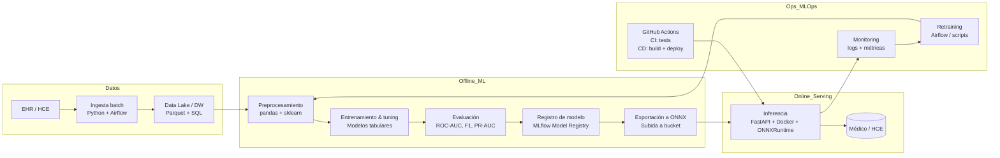

Rare Disease Triage – Pipeline MLOps (Reestructuración Semanas 5–6)

Autor: D. W
Curso: MLOps – Semanas 5–6
Repositorio: https://github.com/Danielgm93/Enfermedades-mlops-U2

Este repositorio describe un pipeline MLOps end-to-end para un sistema de triage clínico que estima la probabilidad de que un paciente presente una enfermedad común o una enfermedad huérfana, a partir de síntomas y variables clínicas básicas. Esta propuesta corresponde a la reestructuración solicitada en las semanas 5–6 del curso.

La reestructuración incorpora los principios de MLOps vistos en todas las unidades, retomando la propuesta inicial (Semanas 1–2) y elevándola a un diseño completo, explícito y listo para ser implementado por un equipo de ML.

1. Problema y Alcance
1.1 Descripción del problema

Los sistemas de salud registran grandes volúmenes de datos para enfermedades frecuentes, pero la disponibilidad de datos para enfermedades huérfanas es limitada. El objetivo es desarrollar un modelo capaz de:

Determinar si un paciente no presenta indicios relevantes.
Detectar posibles enfermedades comunes (leve, aguda o crónica).
Identificar posibles casos compatibles con enfermedades huérfanas, priorizando alta sensibilidad.
El sistema es una herramienta de apoyo al triage médico, no un sistema diagnóstico.

1.2 Objetivo del pipeline MLOps
El pipeline debe permitir:
Transformar datos clínicos crudos en modelos entrenados, versionados y auditables.
Exportar los modelos finales a formato ONNX para ejecución eficiente.
Servir el modelo vía API en entorno local o en la nube.
Implementar CI/CD con pruebas automáticas y despliegue controlado.
Monitorear el comportamiento del modelo en producción y activar ciclos de reentrenamiento cuando sea necesario.

2. Suposiciones, Restricciones e Implicaciones
2.1 Suposiciones generales
Existe acceso controlado a datos anonimizados de historias clínicas electrónicas (EHR/HCE).
El entrenamiento del modelo se realiza en un entorno offline y batch.
El servicio de inferencia corre en un contenedor Docker.
Los modelos versionados se almacenan en un bucket externo.
FastAPI es utilizado como servidor de inferencia.

2.2 Restricciones
Cumplimiento de normas de privacidad y ética médica.
Manejo de desbalance extremo por enfermedades huérfanas.
Debe funcionar localmente o como servicio remoto.
El modelo final debe ser entregado en formato ONNX.

2.3 Implicaciones por etapa
Los pipelines deben estar separados en entrenamiento (offline) e inferencia (online).
El almacenamiento externo obliga a usar un mecanismo de descarga confiable desde la API.
El uso de ONNX limita algunas arquitecturas pero mejora portabilidad y eficiencia.
---

## 3. Arquitectura general

---
3. Diagrama General del Pipeline (versión textual)

El diagrama debe incluir este flujo general, que corresponde a la arquitectura solicitada:
Ingesta de Datos →
Anonimización y Validación →
Almacenamiento en Data Lake →
Preprocesamiento y Feature Engineering →
Manejo de Desbalance →
Entrenamiento del Modelo →
Validación y Métricas →
Registro en MLflow →
Exportación a ONNX →
Almacenamiento del modelo en Bucket Externo →
Construcción de Imagen Docker →
CI/CD con GitHub Actions →
Despliegue (local o nube) →
Monitoreo de predicciones →
Detección de drift →
Reentrenamiento y ciclo iterativo.

4. Etapas del Pipeline End-to-End (con justificación y suposiciones por etapa)
4.1 Ingesta y Gobierno de Datos

Incluye extracción periódica desde EHR, anonimización y validación de integridad.
Tecnologías: Airflow, pandas, Parquet, SQL, S3/GCS/Azure.

Justificación: Airflow permite orquestación batch, dependencias, DAG reproducibles y manejo estable de flujos clínicos.
Suposición: El acceso a EHR es batch, no streaming.
Implicación: El pipeline no requiere servicios de baja latencia.

4.2 Preprocesamiento y Feature Engineering

Incluye limpieza de variables clínicas, validación de esquema, escalado, encoding y construcción de features.

Tecnologías: sklearn.Pipeline, ColumnTransformer.

Justificación: sklearn permite estructurar transformaciones reproducibles y exportables. ColumnTransformer permite aplicar transformaciones por tipo de variable.
Suposición: Las variables clínicas están estandarizadas.
Implicación: No se requiere procesamiento semántico adicional.

4.3 Manejo de Desbalance y Modelado

Aplicación de oversampling, class weights o pipelines de dos etapas para mejorar sensibilidad en clases raras.

Modelos recomendados: Logistic Regression, RandomForest, XGBoost.

Justificación: Son modelos robustos, interpretables y compatibles con exportación a ONNX. XGBoost es adecuado para relaciones no lineales.
Suposición: El oversampling no modifica en exceso la distribución clínica.
Implicación: Se debe monitorear el recall en clases huérfanas.

4.4 Entrenamiento y Validación

Validación cruzada como StratifiedKFold o separación temporal.

Métricas clave: ROC-AUC, PR-AUC, F1, recall para clases raras.

Justificación: Las métricas deben medir desempeño global y sensibilidad en clases de muy baja prevalencia.
Suposición: Los datos tienen marcas temporales confiables.
Implicación: Se puede aplicar validación temporal para evitar fugas.

4.5 Registro y Exportación a ONNX

El modelo se registra con MLflow (tracking y registry) y se exporta a ONNX con skl2onnx.

Justificación: ONNX permite ejecución ligera en CPU local y contenedores. MLflow soporta versionado y ciclo de vida de modelos.
Suposición: La API de inferencia podrá cargar ONNXRuntime.
Implicación: Se prioriza velocidad sobre arquitecturas muy complejas.

4.6 Servicio de Inferencia (FastAPI + Docker)

El servicio descarga el modelo desde el bucket, ejecuta inferencia con ONNXRuntime y registra predicciones en archivos .txt.

Archivos de log:
predicciones_dev.txt
predicciones_prod.txt

Justificación: FastAPI permite validación de entrada, alta velocidad y documentación automática. Docker permite despliegue consistente.
Suposición: El médico puede ejecutar Docker localmente.
Implicación: La imagen debe ser liviana y sin dependencias innecesarias.

4.7 CI/CD y MLOps

GitHub Actions:
Etapa de pruebas:
Descarga del modelo ONNX
Validación de inferencia
Métrica mínima definida
Etapa de build/promote:
Construcción de imagen Docker
Publicación en GHCR
Despliegue automático a dev/prod
Monitoreo continuo:
Logs de predicciones
Detección de drift

Activación del pipeline de reentrenamiento

Justificación: GitHub Actions es nativo al repositorio y simplifica automatización sin infraestructura extra.
Suposición: El bucket y GHCR están correctamente autenticados.
Implicación: Las credenciales deben administrarse por secretos.

5. Implementación Actual del Repositorio

API FastAPI: app/app.py
Modelo placeholder basado en reglas: model/rules.py
Dockerfile para ejecución en contenedor
CI/CD con GitHub Actions
Pruebas unitarias en tests/test_rules.py

Workflows:
pr-ci.yml (pruebas en PR)
develop-cicd.yml (build y despliegue)

6. CHANGELOG — Diferencias entre la Propuesta Inicial y la Reestructurada
Propuesta inicial (Semanas 1–2):
Explicación conceptual del problema.
Pipeline general sin detalle técnico.
No había especificación de tecnologías ni etapas MLOps formales.
Propuesta reestructurada (Semanas 5–6):
Descripción detallada de cada etapa del pipeline.
Inclusión de suposiciones e implicaciones por etapa.
Tecnologías justificadas explícitamente.

CI/CD completamente definido.
Monitoreo y reentrenamiento incluidos.
Exportación ONNX y despliegue en contenedores contemplados.
Integración directa con el código del repositorio.
Inclusión del diagrama general solicitado.

7. Estructura del Repositorio

/mlops-rare-disease
├─ README.md

├─ pipeline.md

├─ CHANGELOG.md

├─ Dockerfile

├─ .dockerignore

├─ requirements.txt

├─ app/

│ └─ app.py

├─ model/

│ └─ rules.py

├─ tests/

│ └─ test_rules.py

└─ .github/

└─ workflows/

├─ pr-ci.yml

└─ develop-cicd.yml

8. Documentación del Pipeline y Cambios

El archivo pipeline.md contiene el detalle completo del flujo end-to-end, junto con elementos técnicos y decisiones de diseño.
El archivo CHANGELOG.md resume los cambios entre la propuesta inicial y la reestructurada.

9. Referencias
Documentación de GitHub Actions
Documentación ONNX y ONNXRuntime
- [Documentación de GitHub Actions](https://docs.github.com/en/actions)
- [Exportación de Modelos a ONNX](https://onnx.ai/)

